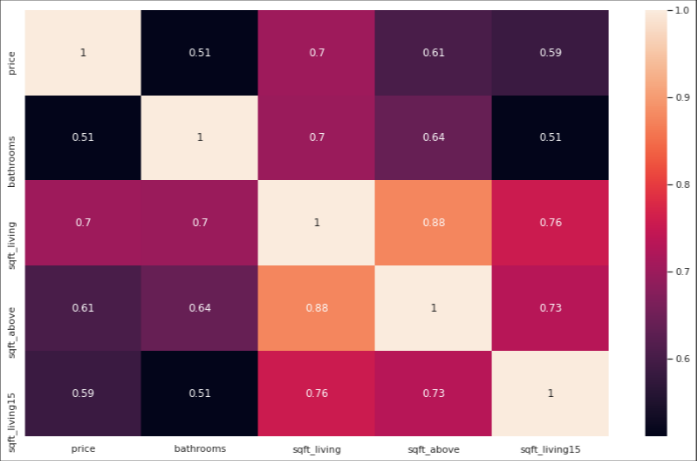

# House Sales  
https://www.kaggle.com/harlfoxem/housesalesprediction

  

# Business Question
<b>The data below, as well as its context, is completely fictitious and this is an Insights Project based on the blog ‘SejaUmDataScientist’ [5].</b>

House Rocket's CEO would like to maximize the company's revenue by finding good business opportunities. Your main strategy is to buy good properties in great locations at low prices and then resell them later at higher prices. The greater the difference between buying and selling, the greater the company's profit and therefore the greater its revenue. However, properties have many attributes that make them more or less attractive to buyers and sellers, and location and time of year can also influence prices.

So, in this project, the objective is to analyze the real estate data and thus help the CEO to maximize the company's profits by answering the questions below:
<b> 

- What are the properties that HR should buy and at what price?

- Once the property has been purchased, what is the best time to sell it and at what price?

- Should House Rocket do a renovation to increase the sale price? What would be the suggestions for changes? What is the price increase given for each refurbishment option?</b> 

# Business Assumptions
- It will be considered in this project that YoY real estate sales in the US increased in the years 2010 - 2020 and that real estate sales below 200,000 fell and those of 400,000 and above rose.[2] 

  

- As for the renovation of the property or not, it will be taken into account the fact that a renovation can increase the value of a property by 30%. [3] 

# Solution Strategy

The final product will be 3 Reports in .csv:
- Report with apartment purchase suggestions for a recommended value;
- Report with suggestions for selling a property for a recommended value;
- Report with suggestion for reform.

## Tools 
 

  <ul>
    <li><a href="https://www.python.org/">Python 3.9</a></li>
    <li><a href="https://jupyter.org/">Jupyter Notebook</a></li>
    <li>CRISP-DS Management Method</li>
  </ul>
 

## Procedure

### <b>What properties should HR buy and at what price?</b>
To answer this question the following steps will be followed:

- Collect data in Kaggle [1];
- Group data by region (zipcode);
- Within each region, find the median property price.
- Suggest that properties that are below the average price for each region and that are in good condition (condition) be purchased.

With this, it will be possible to assess the supply and demand for properties by region, a factor that can influence the property's valuation. 

### <b>Once the property has been purchased, when is the best time to sell it and at what price?</b>

The objective will be to evaluate in which season of the year the properties are cheaper.
As the data has already been processed and organized...
- Group properties by region (zipcode) and by seasonality (seasons of the year)
- Calculate the median price in each region and seasonality
- Sale conditions:
  - 1 - if the purchase price is greater than the regional median + seasonality, then: the sale price will be equal to the purchase price + 10%;
  - 2 - if the purchase price is less than the regional median + seasonality, then: the sale price will be equal to the purchase price + 30%

### <b>Should House Rocket do a renovation to raise the sale price? What would be the suggestions for changes? What is the price increase given for each refurbishment option?</b>
In this case, only properties that were not recommended for purchase will be selected, that is, we will simulate whether with the renovation it would become suitable for purchase or not, following the conditions: 

- The property will be renovated if its condition is 3 or 4 and the profit percentage is 10%
  - the renovation of the living room and bathrooms will be recommended, and a 10% increase in the property's sale value.

# Key Business Insights

Through exploratory data analysis, we acquired some business insights, which are as follows:

- <b>“Properties that overlook the water are 20% more expensive, on average.”
False:</b> Houses with a view of the water are 200% more expensive.

- <b>“Properties with a construction date less than 1955 are 50% cheaper, on average.”
False:</b> Properties with a construction date less than 1955 are 15% cheaper.

- <b>“Properties that have 3 bathrooms are 30% more expensive, on average.”
False:</b> Compared to properties with 1 or 2 bathrooms, the price is 60% higher. It is possible to observe that properties with more than 3 bathrooms have a very high (average) price.

- <b>“Properties that have 2 floors are 30% more expensive, on average.
False:</b> Properties with 2 floors are 42% more expensive. 

- <b>“Properties are 30% more expensive in the summer, on average.”
False:</b> The average price per season is equal and is not increasing. 

- <b>The attributes of the property that most influence the price are: bathrooms, living rooms (sqft_living) and the property's size separated from the basement (sqft_above):</b>

  

# Financial Results

With the suggestion to purchase only properties that are below the average price in the region and are in good condition, House Rocket stops buying overvalued properties and in bad conditions that would probably not be sold easily, and may even undergo a renovation, which would increase even more the cost.

  

As can be seen in the item "Procedure" of this article, a sale rule was created for the properties that 'House Rocket' would buy along with the price. Following this rule, the company will have a profit of 1,209,722,762.00.

  

Again, following what was defined in “Procedure”, a report was made available that informs whether the property should be renewed if the percentage of its profit is 10%.
If you follow this rule and consider only the properties to be renovated, House Rocket will have a profit of 31,550,965.65.

  

# Conclusion

At the end of this project it was possible to reach a very good number for maximizing the profits of 'House Rocket', the CEO now has in hand which houses should buy or not, the sale price and whether or not they need a renovation, being thus it is correct to say that the main objective of this project was successfully achieved.

# Next Steps

The next steps for this project would be to create a classification for the properties, for example: if the property was an urban or rural property, if it is a house, an apartment, a studio. This would be possible by evaluating its attributes, for example, the number of bathrooms, the number of floors, whether it has a basement or not, among others.

# References

House Sales in King County, USA. <b>Kaggle</b>. Available in:
<https://www.kaggle.com/harlfoxem/housesalesprediction>.

CRIVELLI, Cesar. “O Novo Boom Imobiliário nos EUA”. <b>Investing</b>. Available in:
<https://br.investing.com/analysis/o-novo-boom-imobiliario-nos-eua-200440130>

LIMA, Veronica. “Reforma de casa: saiba quais mudanças valorizam o imóvel”. <b>Estadão</b>. Available in: <https://imoveis.estadao.com.br/investir-imoveis/reforma-de-casa-saiba-quais-mudancas-valorizam-o-imovel-para-a-venda/> 

<b>Aula #08 - Projeto de Insights + Abertura da Comunidade DS.</b> Available in: <https://youtu.be/DSVQ3HcxEPw> 

<b>Blog “Seja um DataScientist - Meigarom”.</b> Available in: <https://sejaumdatascientist.com/>
